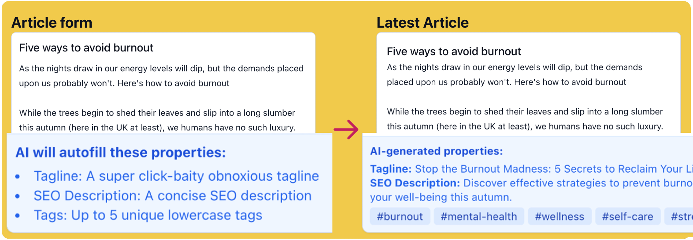

# Demo of using AI Autofill

UI to show the power of AI autofill. This is setup to autofill properties on Articles and Meeting Notes.

- [Get ashleyhindle/laravel-ai-autofill](https://github.com/ashleyhindle/laravel-ai-autofill)

## Setup
1. `composer install`
2. `./artisan key:generate`
3. Add OpenAI key to the bottom of `.env` - `cp .env.example .env`
4. `./artisan serve`
5. [http://127.0.0.1:8000](http://127.0.0.1:8000)

## Usage
Fill in the article or meeting notes form and it'll AI autofill the properties shown, then you can see the result on the right.

You can modify `App\Models\Article` and `App\Models\MeetingNote` to change the AI Autofill settings.
